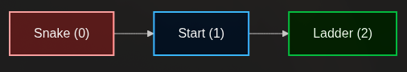
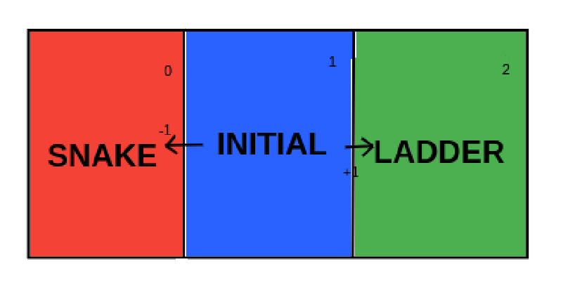
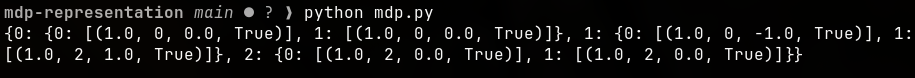

# MDP REPRESENTATION

## AIM:
The aim of this experiment is to develop a Markov Decision Process (MDP) model and implement it in Python to simulate the decision-making process of an agent in a simplified Snake and Ladder bandit walk environment.


## PROBLEM STATEMENT:

### Problem Description
An agent is placed in a minimal grid environment consisting of three sequential positions. The agent starts in the middle "Safe Start" position. If the agent takes a step to the left, it encounters a "Snake" and incurs a penalty. If it takes a step to the right, it finds a "Ladder" and receives a reward. Both the Snake and the Ladder act as terminal states that end the current episode. The goal is to formulate this environment as an MDP to allow an agent to learn the optimal policy of moving towards the ladder.

### State Space
The state space ($S$) represents the distinct grid positions the agent can occupy.

$S$ = {0, 1, 2\}

0. Snake (Terminal state)
1. Safe Start (Initial state)
2. Ladder (Terminal state)

### Sample State
1 - Safe Start 

### Action Space
The action space ($A$) consists of the directional movements the agent can take from the non-terminal state.

$A$ = {{Left}, {Right}}

### Sample Action
Right

### Reward Function
The reward function $R(s, a, s')$ provides the numerical feedback for the agent's transitions.

-1: Transitioning from state $1$ to state $0$ (Action Left).

+1: Transitioning from state $1$ to state $2$ (Action Right).

0: Any action taken while already in a terminal state ($0$ or $2$).

### Graphical Representation




## PYTHON REPRESENTATION:
```py 

p = {
    0: { 
        0: [(1.0, 0, 0.0, True)],  
        1: [(1.0, 0, 0.0, True)]  
    },
    1: {  
        0: [(1.0, 0, -1.0, True)], 
        1: [(1.0, 2, 1.0, True)]   
    },
    2: {  
        0: [(1.0, 2, 0.0, True)],  
        1: [(1.0, 2, 0.0, True)]  
    }
}

print(p)
```

## OUTPUT:


## RESULT:
Thus, the Markov Decision Process (MDP) for the Snake and Ladder bandit walk was successfully modeled, mapping state $0$ to the snake, $1$ to the safe start, and $2$ to the ladder, and its transition dynamics were successfully simulated using Python.

